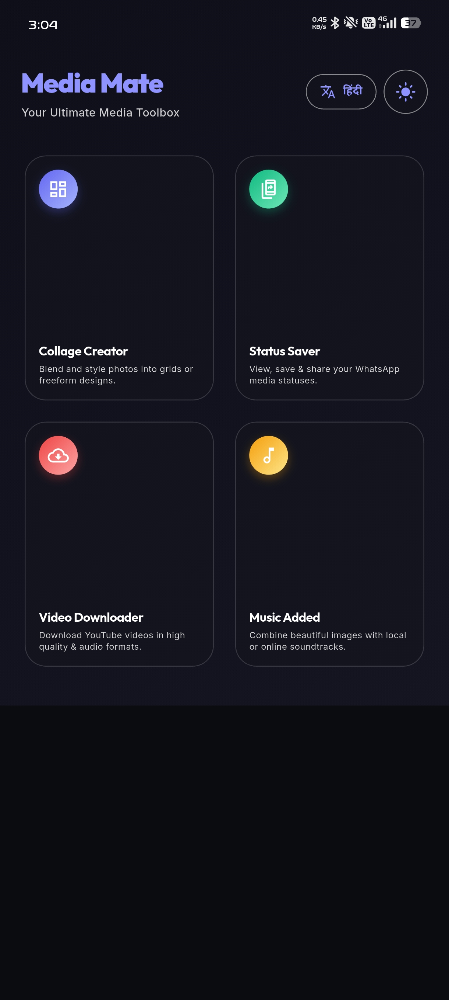
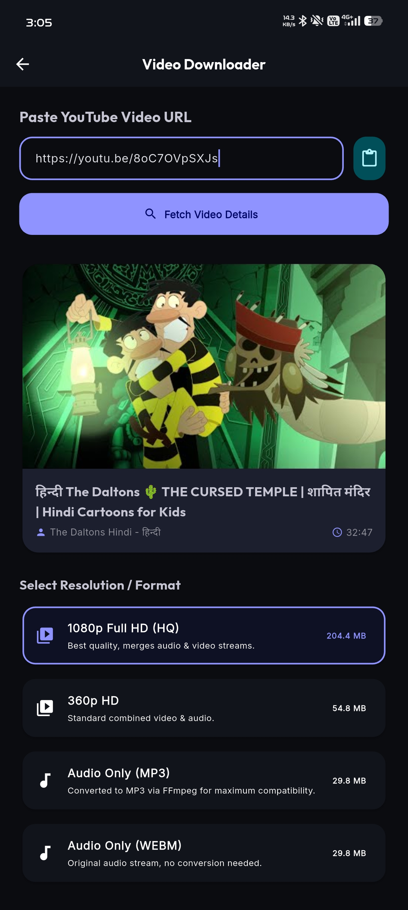
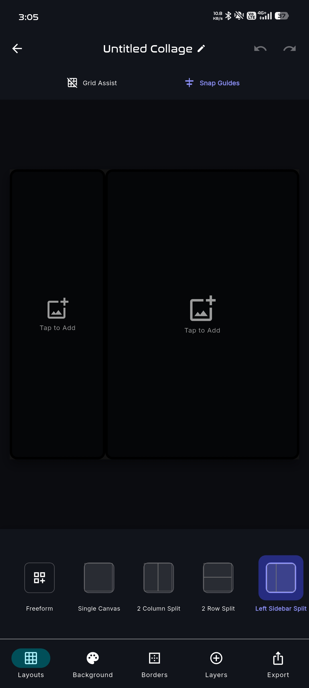
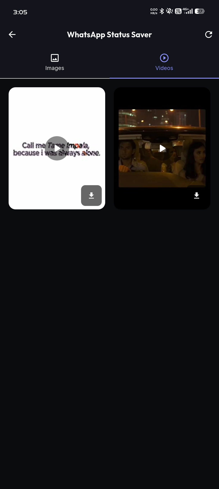
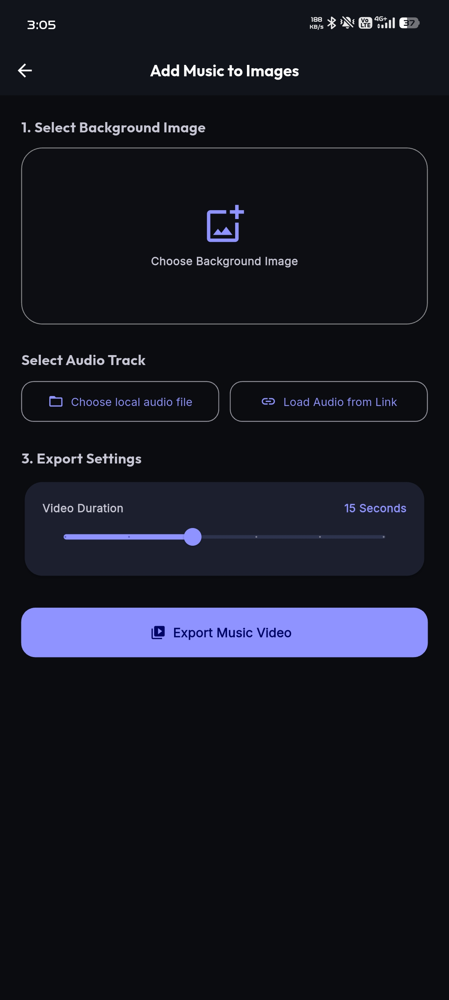

# Media Mate 📱

Media Mate is an all-in-one media utility toolbox for Android, built with Flutter. It brings together several practical media tools into a single, high-performance, and beautifully designed application.

---

## 📸 Screenshots

| Home | Downloader |
|------|------------|
|  |  |

| Collage | Status Saver |
|---------|-------------|
|  |  |

| Image to Video |
|---------------|
|  |


## ✨ Features

### 🎨 1. Collage Creator
* Combine multiple photos into customizable grid layouts or freeform canvases.
* Adjust border thickness, corner radius, and spacing.
* Apply filters and adjust brightness, contrast, and saturation.
* Set solid color backgrounds or smooth gradients.
* Save output directly as high-resolution PNG or JPEG.

### 📥 2. WhatsApp Status Saver
* Auto-scan and preview WhatsApp and WhatsApp Business media statuses (both images and videos).
* Save media files directly to the native device Gallery under a dedicated "Media Mate" album.
* Easy sharing via native platform share sheets.

### 🎥 3. Video & Audio Downloader
* Paste YouTube video URLs to fetch details (title, duration, author) and download streams.
* Supports downloading combined video/audio, high-bitrate separate streams (e.g., Full HD 1080p, which are merged on-device), or extracting high-quality audio tracks.
* Transcodes audio streams on-the-fly to compliant MP3 format using local FFmpeg processing.
* Features a fallback share mechanism to bypass modern Android Scoped Storage directory limits.

### 🎵 4. Add Music to Images
* Mix static images with local audio tracks or preset online loops.
* Generate video clips with a running waveform visualizer.
* Perfect for creating social media story clips or short music slides.

---

## 🛠️ Tech Stack & Dependencies

*   **Framework**: [Flutter](https://flutter.dev) (Dart)
*   **State Management**: [Riverpod](https://riverpod.dev)
*   **Media Saving**: [Gal](https://pub.dev/packages/gal)
*   **Media Processing**: [FFmpeg Kit](https://pub.dev/packages/ffmpeg_kit_flutter_new)
*   **YouTube API**: [Youtube Explode](https://pub.dev/packages/youtube_explode_dart)
*   **Audio Playback**: [Audioplayers](https://pub.dev/packages/audioplayers)

---

## 📥 Installation

You can download the compiled APK file directly from the **Releases** tab on the right side of this repository, or run the project locally.

### Running Locally

1. Clone the repository:
   ```bash
   git clone git@github.com:5UBH4M/media-mate.git
   cd media-mate
   ```
2. Get dependencies:
   ```bash
   flutter pub get
   ```
3. Run the application:
   ```bash
   flutter run
   ```
